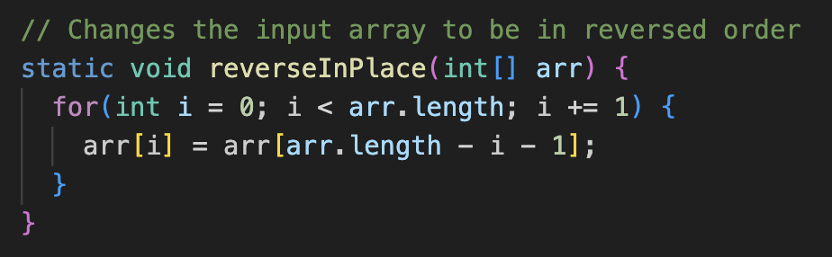

* The method I chose for this lab is the reverseInPlace method. The method is supposed to reverse the order of an array, but it only works for arrays with a length of 1. Rather than using a new array to hold the original values or to hold the new values, it uses the same array which causes it to replace some of the values.


```
@Test
public void testReverseInPlace1(){
int[] input1 = {5};
ArrayExamples.reverseInPlace(input1);
assertArrayEquals(new int[]{5}, input1);
}
```
* The input that doesn't induce a failure for the `reverseInPlace` method is shown in the code block above.

```
@Test
public void testReverseInPlace2(){
int[] input1 = {1, 2, 3, 4, 5};
ArrayExamples.reverseInPlace(input1);
assertArrayEquals(new int[]{5, 4, 3, 2, 1}, input1);
}
```
* The failure-inducing input for `reverseInPlace` method is shown in the code block above.
