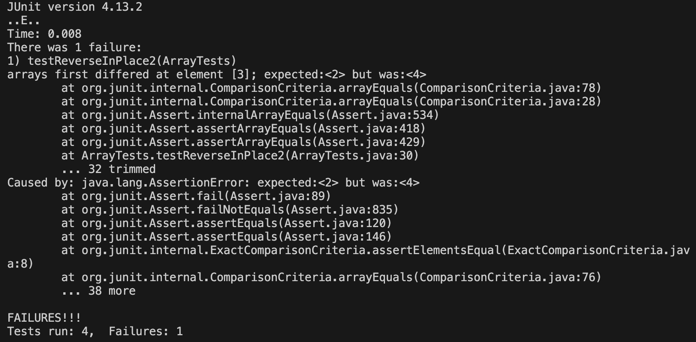
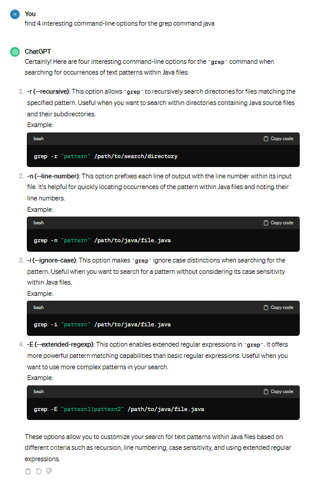

# Part 1

```
@Test
public void testReverseInPlace1(){
  int[] input1 = {5};
  ArrayExamples.reverseInPlace(input1);
  assertArrayEquals(new int[]{5}, input1);
}
```
* The input that doesn't induce a failure for the `reverseInPlace` method is shown in the code block above.

```
@Test
public void testReverseInPlace2(){
  int[] input1 = {1, 2, 3, 4, 5};
  ArrayExamples.reverseInPlace(input1);
  assertArrayEquals(new int[]{5, 4, 3, 2, 1}, input1);
}
```
* The failure-inducing input for `reverseInPlace` method is shown in the code block above.


* The symptom, as the output of running the tests, is shown in the screenshot above.

```
static void reverseInPlace(int[] arr) {
  for(int i = 0; i < arr.length; i += 1) {
    arr[i] = arr[arr.length - i - 1];
  }
}
```
* The code block above shows the buggy method before the code change.

```
static void reverseInPlace(int[] arr) {
  int[] temp = new int[arr.length];
  for(int x = 0; x < arr.length; i += 1) {
    temp[x] = arr[x];
  for(int i = 0; i < temp.length; i += 1) {
    arr[i] = temp[temp.length - i - 1];
  }
}
```
* The code block above shows the buggy method after the code change. When running the tests with this updated method, all of the tests pass and there are no failures.
* The previous issue with the code (before the code change) was that since the input and output both used the same array, the values would be overwritten. This causes the second half of the array to be incorrect. By making a temporary array to store the original array, the original values are not overwritten and the issue is fixed.

# Part 2

`grep -r`

```
grep -r ".txt" technical/biomed

technical/biomed/gb-2003-4-5-r34.txt:            20,000), and repeat the process. The Readme.txt file
technical/biomed/gb-2001-2-7-research0025.txt:        Pfam_Annotation.txt
technical/biomed/gb-2001-2-7-research0025.txt:        Protein_Annotation.txt
technical/biomed/gb-2002-3-7-research0037.txt:        README.txt contains instructions for installation and
technical/biomed/gb-2002-3-6-software0001.txt:        as .txt files (tab-delimited text, refer to the user's
technical/biomed/gb-2002-3-12-research0078.txt:          .txt extension.
technical/biomed/gb-2001-2-9-research0037.txt:          hyb2dis.txt in additional data files). More importantly,
technical/biomed/gb-2001-2-9-research0037.txt:        hyb2dis.txt: patch file that converts White's hybridize
technical/biomed/gb-2001-2-9-research0037.txt:        Training sets(GlycineMedicago.txt,Rhizobia.txt,
technical/biomed/gb-2001-2-9-research0037.txt:        Stramenopiles.txt, ZygoChytrid.txt): FASTA-formatted text
technical/biomed/gb-2001-2-9-research0037.txt:        Test sets(PsojaeHA.txt, PsojaeMY.txt, PsojaeZO.txt,
technical/biomed/gb-2001-2-9-research0037.txt:        MtRHE.txt, DSIR.txt, MHAM.txt, KV0.txt, KV2.txt, KV3.txt):
technical/biomed/gb-2001-2-9-research0037.txt:        hyb2dis.txt
technical/biomed/gb-2001-2-9-research0037.txt:        hyb2dis.txt
technical/biomed/gb-2001-2-9-research0037.txt:        GlycineMedicago.txt
technical/biomed/gb-2001-2-9-research0037.txt:        Rhizobia.txt
technical/biomed/gb-2001-2-9-research0037.txt:        Stramenopiles.txt
technical/biomed/gb-2001-2-9-research0037.txt:        ZygoChytrid.txt
technical/biomed/gb-2001-2-9-research0037.txt:        PsojaeHA.txt
technical/biomed/gb-2001-2-9-research0037.txt:        PsojaeMY.txt
technical/biomed/gb-2001-2-9-research0037.txt:        PsojaeZO.txt
technical/biomed/gb-2001-2-9-research0037.txt:        MtRHE.txt
technical/biomed/gb-2001-2-9-research0037.txt:        DSIR.txt
technical/biomed/gb-2001-2-9-research0037.txt:        KV0.txt
technical/biomed/gb-2001-2-9-research0037.txt:        KV2.txt
technical/biomed/gb-2001-2-9-research0037.txt:        KV3.txt
technical/biomed/1471-2105-2-9.txt:            of files (e.g., seq or txt files) or from a
technical/biomed/1471-2105-2-9.txt:            fasta_groups.txt output file contains the group name
technical/biomed/1471-2105-2-9.txt:            format. The fasta_groups.txt file is particularly
technical/biomed/1471-2105-2-9.txt:            output file, group_seqs.txt, contains the group name
technical/biomed/1471-2105-2-9.txt:            output file, group_files.txt, contains the group name,
technical/biomed/1471-2105-2-9.txt:            file, coverage.txt, shows how many sequences are in
technical/biomed/1471-2105-2-9.txt:            Good [ 7 ] . Finally, the infile.txt file contains all
technical/biomed/1471-2105-2-9.txt:          from the 3' end and looking at the group_seqs.txt output
technical/biomed/1471-2105-2-9.txt:          to the fasta_groups.txt file, which is ideal for Clustal
technical/biomed/gb-2002-3-12-research0071.txt:        'EtOH.txt', 'SwiSnfMin.txt'and 'SwiSnfRich.txt', and
technical/biomed/gb-2002-3-12-research0071.txt:        'Zinc.txt'.
technical/biomed/1471-2105-2-1.txt:          Also attached are a users' manual (user.txt - see
technical/biomed/1471-2105-3-6.txt:          readme.txt documentation file are also included.
technical/biomed/1471-2105-3-4.txt:          conversions of .chp (.txt) for each individual profile
```
* In this example, the `grep` command is recursively searching through the `biomed` directory to find any `.txt` files. It is useful when searching directories with java source files and their subdirectories.

```
grep -r "1468" technical/911report

jonathankook@Jonathans-MacBook-Pro docsearch_W5 % grep -r "1468" technical/biomed
technical/biomed/1471-2350-2-2.txt:        impact on waist-hip ratio (p=0.1468) after adjustment for
technical/biomed/bcr45.txt:          in exon 11, accession #U14680). After 2 weeks of
technical/biomed/bcr45.txt:          1 to nucleotide 1025 in exon 11, accession #U14680) was
technical/biomed/1471-2156-2-17.txt:        (7.16%) were adenosine while 1468 (82.1%) were guanosine at
```
* In this example, the `grep` command is recursively searching through the `911report` directory to find any files that contain `1468` in them. It is useful when searching directories with java source files and their subdirectories.

`grep -n`

```
grep -n "President Bush" technical/911report/chapter-10.txt

36:            Air Force One arrived at Offutt at 2:50 P.M. At about 3:15, President Bush met with
39:            Rice said President Bush began the meeting with the words, "We're at war," and that Director of Central Intelligence George Tenet said
56:                still-smoldering Pentagon. At 8:30 that evening, President Bush addressed the nation
63:            Following his speech, President Bush met again with his National Security Council
84:                Determining federal assistance. On September 13, President Bush promised to
110:                Council system. Vice President Cheney reviewed the proposal with President Bush and
111:                other advisers. President Bush announced the new post and its first occupant-
217:                domestic department heads broke up, President Bush chaired a smaller meeting of top
237:            President Bush chaired two more meetings of the NSC on September 12. In the first
286:                President Bush led a discussion of an appropriate ultimatum to the Taliban. He also
292:            President Bush also tasked the State Department, which on the following day delivered
314:            President Bush recalled that he quickly realized that the administration would have
325:                15-16, as President Bush convened his war council at Camp David.
333:                military's Special Operations units. President Bush later praised this proposal,
340:                possible significant use of ground forces- and that is where President Bush
343:            After hearing from his senior advisers, President Bush discussed with Rice the
345:                prepared a paper that President Bush then considered with principals on Monday
350:                President Bush charged Ashcroft, Mueller, and Tenet to develop a plan for homeland
351:                defense. President Bush directed Secretary of State Powell to deliver an ultimatum
359:                Bin Ladin. Shortly thereafter, President Bush authorized broad new authorities for
362:            President Bush instructed Rumsfeld and Shelton to develop further the Camp David
398:            President Bush had wondered immediately after the attack whether Saddam Hussein's
407:            Clarke has written that on the evening of September 12, President Bush told him and
410:                incorrect, President Bush acknowledged that he might well have spoken to Clarke at
457:                deal with the Iraq problem." Powell said that President Bush did not give
459:                worry about Iraq in the following week, Powell said, President Bush saw Afghanistan
462:            President Bush told Bob Woodward that the decision not to invade Iraq was made at the
466:            Rice said that when President Bush called her on Sunday, September 16, he said the
474:            President Bush ordered the Defense Department to be ready to deal with Iraq if
508:            On September 20, President Bush met with British Prime Minister Tony Blair, and the
515:                military responses in Iraq during the summer before 9/11-a request President Bush
523:                enforce Iraqi no-fly zones. Franks said that President Bush again turned down the
527:                Thursday, September 20, President Bush addressed the nation before a joint session
540:            President Bush argued that the new war went beyond Bin Ladin." Our war on terror
548:            President Bush approved military plans to attack Afghanistan in meetings with Central
```
* In this example, the `grep` command searches through `911report/chapter-10.txt` and outputs the line / line number of any lines that contains `President Bush`. This command is useful when trying to find the exact line where something is mentioned in a file, especially in longer files.

```
grep -n "DECLARATION OF WAR" technical/911report/chapter-2.txt

5:            A DECLARATION OF WAR
```
* In this example, the `grep` command searches through `911report/chapter-2.txt` and outputs the line / line number of any lines that contains `DECLARATION OF WAR`. This command is useful when trying to find the exact line where something is mentioned in a file, especially in longer files.

`grep -i`

```
grep -i "president" technical/911report/chapter-3.txt

President Bill Clinton ordered his National Security Council to coordinate the
                President Clinton, his principal advisers, the Congress, nor the news media felt
                looming, President Franklin D. Roosevelt ordered FBI Director J. Edgar Hoover to
                the president, and the FBI's domestic intelligence activities kept growing. In the
                Meanwhile, a task force headed by Vice President George H.W. Bush had endorsed a
            FBI Organization and Priorities In 1993, President Clinton chose Louis Freeh as the
                Firearms. Given the Secret Service's mission to protect the president and other high
                greater consequence. In 1996, a presidential commission on aviation safety and
                security chaired by Vice President Al Gore reinforced the prevailing concern about
                intelligence from all sources. The CIA's number one customer is the president of the
                is not technically a member of the president's cabinet. The director's power under
                been directly proportional to his personal closeness to the president, which has
                of the Office of Strategic Services (OSS), which President Roosevelt created early
            At the end of World War II, to Donovan's disappointment, President Harry Truman
                dissolved the Office of Strategic Services. Four months later, the President
                representative of the president. This body was to be assisted by a Central
            Subsequently, President Truman agreed to the National Security Act of 1947, which,
                President had not taken plain responsibility for these judgments. CIA officials had
                President's "plausible deniability."
                Amendment requiring that the president approve and report to Congress any covert
                that the legal basis and presidential authorization for their actions were
                Intelligence Brief-or, better still, selected for inclusion in the President's Daily
            In the mid-1980s, on the basis of a report from a task force headed by Vice President
                President Clinton appointed George Tenet as DCI in 1997, and by all accounts
                department dominated the processes of advising the president and Congress on U.S.
                mini-state department was created to analyze foreign policy issues. President
                Congress or in the president's Office of Management and Budget. Like the FBI and the
                Department leadership in counterterrorism. President Carter's assertive national
                remained thereafter in the White House. President Reagan's second secretary of
                congressional opposition prevented President Clinton's first secretary of state,
                secretary of defense has ultimate control, under the president. Among the uniformed
                presented to the president. The Goldwater-Nichols example is seen by some as having
            In 1983 came Hezbollah's massacre of the Marines in Beirut. President Reagan quickly
                Desert One and the withdrawal from Beirut. The first President Bush had authorized
                Congress, President Clinton soon ordered the withdrawal of U.S. forces. "Black Hawk
                counterterrorism. By the end of President Clinton's first term, this official had
                Colonel Muammar Qadhafi. President Reagan ordered air strikes against Libya. The
                Washington that Iraqi agents were planning to assassinate the former president.
                President Clinton not only ordered precautions to protect Bush but asked about
                presidential staff coordinate counterterrorism. After the killing of the marines in
                Beirut, President Reagan signed National Security Directive 138, calling for a
            Speaking to the American Bar Association in July 1985, the President characterized
            Through most of President Reagan's second term, the coordination of counterterrorism
            President Reagan was concerned because Hezbollah was taking Americans hostage and
                became more formal. The advisor developed recommendations for presidential
                directives, differently labeled by each president. For President Clinton, they were
                to be Presidential Decision Directives; for President George W. Bush, National
                the president worked their way through interagency committees usually composed of
                national security advisor. When President Clinton took office, he decided right away
                bombing and, a few weeks after that, the Iraqi plot against former President Bush.
            President Clinton's first national security advisor, Anthony Lake, had retained from
                Clarke. President Clinton and Lake turned to Clarke to do the staff work for them in
                the plot to kill President Bush, President Clinton stated:"From the first days of
            In his State of the Union message in January 1995, President Clinton promised
                Veigh and Terry Nichols. President Clinton proposed to amend his earlier proposals
            President Clinton issued a classified directive in June 1995, Presidential Decision
                President Clinton made it the very highest priority for his own staff and for all
            During 1995 and 1996, President Clinton devoted considerable time to seeking
                President Clinton mentioned terrorism first in a list of several challenges facing
            In 1998, after Bin Ladin's fatwa and other alarms, President Clinton accepted a
                counterterrorism. He issued two Presidential Decision Directives, numbers 62 and 63,
                that built on the assignments to agencies that had been made in Presidential
                commencement speech, this time at the Naval Academy, in May 1998, the President
            Clearly, the President's concern about terrorism had steadily risen. That heightened
                powers sufficiently ambiguous so that room was left for Congress and the president
            The most serious question has centered on whether or not the president needs
                have settled into a recognition that a president can deploy military forces for
            This calculus becomes important in this story as both President Clinton and President
            The president is required by law to ensure the congressional Intelligence committees
                to protect sources, methods, and operations. The CIA must bring presidentially
                scandal, a presidential commission chaired first by former secretary of defense Les
                opposition to the proposed changes. The President and DCI did not actively support
                not to rise very high on the list of congressional priorities. Presidents are
            In the decade before 9/11, presidential discussion of and congressional and public
            Second, Congress tends to follow the overall lead of the president on budget issues
                authorized and appropriated by the Congress comes out close to the president's
                president's Office of Management and Budget.
                1990s imposing sanctions on Pakistan, leaving presidents with little leverage to
            President Bill Clinton's counterterrorism Presidential Decision Directives in 1995
                document authorizing the capture operation. A 1986 presidential finding had
                to help against Bin Ladin. The response was encouraging enough that President
                emissary would be its intelligence chief, Prince Turki bin Faisal. Vice President Al
                with President Clinton's blessing. Tenet reported that it was imperative to get an
            On August 7, 1998, National Security Advisor Berger woke President Clinton with a
                strikes against the sites in Afghanistan. The Pentagon briefed President Clinton
                Shinrikyo's release of sarin nerve gas in the Tokyo subway. President Clinton
            By the early hours of the morning of August 20, President Clinton and all his
                as well as hitting al Shifa. The President took the Sudanese tannery off the target
                and President Clinton flew back from his vacation on Martha's Vineyard to address
                the nation from the Oval Office. The President spoke to the congressional leadership
                Minister Nawaz Sharif, and Egyptian President Hosni Mubarak from the White
                the President. The next month, Gingrich's office dismissed the cruise missile
            At the time, President Clinton was embroiled in the Lewinsky scandal, which continued
                As it happened, a popular 1997 movie, Wag the Dog, features a president who fakes a
                President Clinton, Vice President Gore, Berger, Tenet, and Clarke insisted to us
            Everyone involved in the decision had, of course, been aware of President Clinton's
                problems. He told them to ignore them. Berger recalled the President saying to him
                spotlight the areas of dispute. The Presidential Daily Brief and the similar, more
                Terrorism had moved high up among the President's concerns, and Clarke's position
                relationship had been prescribed in the May 1998 presidential directive (after
                President Clinton and Berger also worried about the Economist's point-that attacks
                strikes. According to Clarke, President Clinton was inclined to launch further
                Abdullah told President Clinton and Vice President Gore about this when he visited
                with Crown Prince Abdullah, Vice President Gore, while thanking the Saudi government
            The State Department urged President Clinton to engage the Pakistanis. Accepting this
                advice, President Clinton invited Sharif to Washington, where they talked mostly
                about India but also discussed Bin Ladin. After Sharif went home, the President
                prevailed in July 1999, when President Clinton issued an executive order effectively
                the Taliban to stop sheltering Bin Ladin. President Clinton contacted Sharif again
            The President suggested that Pakistan use its control over oil supplies to the
                Washington thought this was likely to happen, President Clinton gave the idea his
            The President met with Sharif in Washington in early July. Though the meeting's main
                Kargil confrontation in Kashmir, President Clinton complained about Pakistan's
            As part of the response to the embassy bombings, President Clinton signed a
            Given the President's August Memorandum of Notification, the CIA had already been
            On Friday, December 4, 1998, the CIA included an article in the Presidential Daily
                The following is the text of an item from the Presidential Daily Brief received
                    by President William J. Clinton on December 4, 1998. Redacted material is
                The next day, Director Tenet sent a memo to the President, the cabinet, and senior
                meeting, the principals decided against recommending to the President that he order
            They finally agreed, as Berger reported to President Clinton, that an extraordinary
                sent a final draft to President Clinton, with an explanatory memo. The President
                General Reno had sent a letter to the President expressing her concern: she warned
                the instructions authorized by the President: the United States preferred that Bin
                prefaced the directions with a message:"From the American President down to the
            Policymakers in the Clinton administration, including the President and his national
                security advisor, told us that the President's intent regarding covert action
            In February 1999, another draft Memorandum of Notification went to President Clinton.
                successful capture operation was not feasible. On this occasion, however, President
                ambiguous language. No one we interviewed could shed light on why the President did
                this. President Clinton told the Commission that he had no recollection of why he
                as to whether the CIA was ever authorized by the President to kill Bin Ladin.
                their targets. After the August 20 strikes, President Clinton had had to call
            President Clinton relied on the advice of General Shelton, who informed him that
                was high. Shelton told President Clinton he would go forward with "boots on the
                ground" if the President ordered him to do so; however, he had to ensure that the
                President was completely aware of the large logistical problems inherent in a
                intelligence. President Clinton told the Commission that "if we had had really good
                2001, the United States, and President Clinton personally, pressed the UAE, one of
            In February 1999, Tenet sought President Clinton's authorization to enlist Massoud
                and his forces as partners. In response to this request, the President signed the
                no significance in the President's changes. So far as he was concerned, it was the
            In July 1999, President Clinton authorized the CIA to work with several governments
                lieutenants. The President reportedly also authorized a covert action under
```
* In this example, the `grep` command searches through `technical/911report/chapter-3.txt` and outputs every line that countains the word 'president'. This command is useful when you want to search a file without the keyword/keyphrase being case-sensitive. In other words, it is useful when you want to find something in a file that can be either lowercase, uppercase, or both.

```
grep -i "world war ii" technical/911report/chapter-13.1.txt

The men and women of the World War II generation rose to the challenges of the 1940s
```
* In this example, the `grep` command searches through `technical/911report/chapter-13.1.txt` and outputs every line that countains the phrase `world war ii`. For this example specifically, I searched for lines that contain `world war ii` , and the output was a line that contained `World War II`. This command is useful when you want to search a file without the keyword/keyphrase being case-sensitive. In other words, it is useful when you want to find something in a file that can be either lowercase, uppercase, or both.

`grep -E`

```
grep -E "KSM|USS" technical/911report/chapter-13.4.txt

 1. Though KSM and Bin Ladin knew each other from the anti-Soviet campaign of the
                1980s, KSM apparently did not begin working with al Qaeda until after the 1998 East
                Africa embassy bombings. Intelligence reports, interrogations of KSM, Nov. 21, 2003;
            3. On KSM's relationship to Yousef and his ethnicity, see CIA analytic report, Khalid
                Sheik Muhammad's Nephews, CTC 2003-300013, Jan. 31, 2003. On KSM's biography, see
                Intelligence report, interrogation of KSM, July 12,2003; FBI electronic
                communication, requests for information on KSM colleges/universities, June 10, 2002.
            4. In an uncorroborated post-capture claim that may be mere bravado, KSM has stated
                of KSM, July 12, 2003. On KSM's connection to Sayyaf, see Intelligence reports,
                interrogations of KSM, July 3, 2003; July 12, 2003; FBI electronic communication,
                "Summary of Information . . . with regard to . . . KSM,"July 8,1999. On KSM's battle
                KSM, July 3, 2003; July 12, 2003. On KSM's anti-Soviet activities, see Intelligence
                report, interrogation of KSM, Feb. 17, 2004 (in which KSM says he apparently met Bin
            5. Intelligence report, interrogation of KSM, July 12, 2003 (in which KSM also notes
                killed there). KSM claims that Ramzi Yousef visited the NGO's establishment in
                Jalalabad while Yousef was undergoing training. KSM adds that between 1993 and 1996,
                to his abiding interest in carrying out terrorist operations. Although KSM claims
                admits that Abdallah underwrote a 1995 trip KSM took to join the Bosnia jihad.
                Intelligence report, interrogation of KSM, July 23, 2003.
            6. On KSM's learning of Yousef 's plans, see Intelligence report, interrogation of
                KSM, Jan. 9, 2004 (in which KSM also contends that Yousef never divulged to him the
                intended target of the attack). On KSM/Yousef phone conversations, see Intelligence
                report, interrogation of KSM, Feb. 17, 2004 (in which KSM also says that most of his
                him to send the passport Yousef had in his true name, Abdul Basit). On KSM's money
                On KSM's rationale for attacking the United States, see Intelligence report,
                interrogation of KSM, Sept. 5, 2003 (in this regard, KSM's statements echo those of
                interrogations of KSM, Apr. 17, 2003; July 12, 2003 (in which KSM also says bojinka
                According to KSM, the plot was to receive financing from a variety of sources,
                including associates of co-conspirator Wali Khan and KSM's own funds. Intelligence
                reports, interrogations of KSM, Nov. 26, 2003; Jan. 9, 2004; Feb. 19, 2004. On
                KSM, May 3, 2003; July 12, 2003; Nov. 10, 2003; Feb. 21, 2004; Feb. 24, 2004.
                Abdul Hakim Murad, Apr. 13, 1995; Intelligence report, interrogation of KSM, July
                12, 2003 (in which KSM recounts how he knew Wali Khan from Afghanistan). On the
                the Philippine Airlines flight. See ibid., p. 8. On KSM's travels, see generally
                Intelligence report, interrogation of KSM, July 12, 2003. Yousef managed to escape
                to Pakistan, but his accomplice, Murad-whom KSM claims to have sent to Yousef with
                targeted aircraft, KSM has said that Murad's role was limited to carrying the $3,000
                from Dubai to Manila. Intelligence reports, interrogations of KSM, Feb. 19, 2004;
                (two reports); Feb. 24, 2004; Apr. 2, 2004. This aspect of KSM's account is not
                evidence tying Murad to the very core of the plot, and with KSM's own statements
                Intelligence reports, interrogations of KSM, Aug. 18, 2003; Jan. 9, 2004; Feb. 24,
                2004 (in which KSM also claims that while he was in Qatar in February 1995, he and
                with the operation despite KSM's advice that he hide instead). We have uncovered no
                evidence that KSM was present at the guesthouse in Islamabad where Yousef 's arrest
            9. Intelligence report, interrogation of KSM, July 12, 2003. KSM's presence in Bosnia
                bomb (a modified Casio watch) resembled those manufactured by KSM and Yousef in the
                interrogation of SM, July 12, 2003 (in which KSM also claims to have encountered
                Sayf al Adl while in Yemen; apparently KSM has not divulged the substance of this
            10. Intelligence report, interrogation of KSM, Jan. 9, 2004. In another interrogation
                report, however, KSM downplays the significance of his relationship to Yousef in
                enabling him to meet with Bin Ladin. Specifically, KSM notes that Yousef was not a
                interrogation of KSM, Feb. 19, 2004.
            11. Intelligence reports, interrogations of KSM, July 12, 2003; Jan. 9, 2004; Feb.
                19,2004. With respect to KSM's additional proposal to bomb cargo planes by shipping
                jackets containing nitrocellulose, KSM states that Bin Ladin expressed interest in
                report, interrogation of KSM, Nov. 10, 2003.
            12. Intelligence report, interrogation of KSM, Feb. 19, 2004.
            13. Probably inflating his own role, KSM says he and a small group of colleagues,
                United States. KSM asserts that Bin Ladin and some of the other jihadist leaders
                the United States to places like Somalia. On KSM's description of Bin Ladin's
                agenda, see Intelligence report, interrogation of KSM, Nov. 13, 2003. As discussed
                KSM's proposal, see Intelligence reports, interrogations of KSM, July 12, 2003; Jan.
                9, 2004; Feb. 19, 2004. On KSM's intent to target the United States and Bin Ladin's
                interest in Somalia, see Intelligence report, interrogation of KSM, Nov. 13, 2003.
            14. On KSM's independence, see Intelligence report, interrogation of KSM, Jan. 9,
                2004. Even after he began working with Bin Ladin and al Qaeda, KSM concealed from
                KSM, July 30, 2003. Although KSM says he would have accepted the support of another
                this idea to any other group. Intelligence report, interrogation of KSM, Feb. 19,
                of KSM, July 12, 2003. Hambali also was one of the founders of Konsojaya, a
            15. Intelligence reports, interrogations of KSM, July 12, 2003; Feb. 19, 2004 (two
                reports). KSM maintains that he provided similar services for other mujahideen
                by Abu Zubaydah. Intelligence report, interrogation of KSM, Feb. 19, 2004.
            16. On KSM's understanding of Bin Ladin's commitment, see Intelligence report,
                interrogation of KSM, Feb. 19, 2004. On KSM's assistance to al Qaeda, see
                Intelligence reports, interrogations of KSM, July 12, 2003 (two reports). On Bin
                of KSM, Jan. 9, 2004. KSM has observed that the East Africa bombings and the
                subsequent bombing of the USS Cole yielded a recruiting bonanza for al Qaeda, as
                the United States. Intelligence report, interrogation of KSM, Sept. 5, 2003.
            17. On KSM's decision to move to Kandahar, see Intelligence report, interrogation of
                KSM, Jan. 9, 2004. On the media committee, see Intelligence report, interrogation of
                KSM, July 12, 2003 (in which KSM also says that as head of the media committee, he
                bombing of the USS Cole). On the oath, see Intelligence report, interrogation of
                KSM, Nov. 13, 2003 (in which KSM also claims his reluctance stemmed from a concern
                interrogations of KSM, June 27, 2003; July 14, 2003. On a possible Israeli
                operation, see Intelligence report, interrogation of KSM, June 30, 2003. On other
                Hambali, Sept. 4, 2003 (Thailand); Intelligence report, interrogation of KSM, Apr.
            19. For an example of KSM's popularity, see Intelligence report, interrogation of al
                detainee, Mar. 4,2004. On Sufaat, see Intelligence report, interrogation of KSM,
            24. Intelligence report, interrogation of KSM, June 9, 2003. KSM also maintains that
                interrogation of KSM, June 24, 2003.
                report, interrogation of KSM, July 31, 2003. On Hambali's assistance at KSM's
                request, see Intelligence report, interrogation of KSM, July 31, 2003; Intelligence
                Intelligence report, interrogation of KSM, Mar. 24, 2003; Intelligence report,
                KSM, July 8, 2003. On KSM's coordination with Hambali, see Intelligence report,
                interrogation of KSM, Apr. 17, 2003. On KSM's recognition of Hambali's domain, see
                Intelligence report, interrogation of KSM, Aug. 18, 2003. According to KSM, his
                involving himself in al Qaeda's broader terrorist program. Indeed, KSM describes
                interrogation of KSM, Aug.18,2003. Nashiri observes that al Qaeda's standard
                to swear allegiance, see Intelligence report, interrogation of KSM, Nov. 21, 2003.
                seeking Bin Ladin's approval, see Intelligence report, interrogation of KSM, Jan.
            32. See Intelligence reports, interrogations of KSM, July 1, 2003; Sept. 5, 2003.
            33. For KSM's learning from the first World Trade Center bombing and his interest in
                a more novel form of attack, see Intelligence report, interrogation of KSM, July 1,
                2003. For KSM's interest in aircraft as weapons and speculation about striking the
                World Trade Center and CIA, see Intelligence report, interrogation of KSM, Feb. 19,
                2004. KSM has stated that he and Yousef at this time never advanced the notion of
                KSM, Apr. 2, 2004. After 9/11, some Philippine government officials claimed that
                while in Philippine custody in February 1995, KSM's Manila air plot co-conspirator
                the U.S. government. Incidentally, KSM says he never discussed his idea for the
                planes operation with Murad, a person KSM regarded as a minor figure. Intelligence
                report, interrogation of KSM, Apr. 2, 2004.
            35. Intelligence reports, interrogations of KSM, July 12,2003; Nov. 6,2003. Abu
                Zubaydah, who worked closely with the al Qaeda leadership, has stated that KSM
                Bin Ladin urged KSM to expand the operation with the comment, "Why do you use an axe
                statement is Khallad's suggestion that Bin Ladin may have expanded KSM's original
                22, 2004. Neither Abu Zubaydah nor Khallad claims to have been present when KSM says
                KSM, Nov. 6, 2003. For Bin Ladin's response, see Intelligence reports,
                interrogations of KSM, Aug. 18, 2003; Feb. 19, 2004. 492 NOTES TO CHAPTER 5
            37. Intelligence report, interrogation of KSM, Feb. 19, 2004.
            38. For KSM's joining al Qaeda, see Intelligence report, interrogation of KSM, Nov.
                13, 2003. KSM has provided inconsistent information about whether Bin Ladin first
                1999. Compare Intelligence reports, interrogations of KSM, Aug. 18, 2003; Jan. 9,
                2004; Feb. 19, 2004; Apr. 3, 2004. For KSM's antipathy to the United States, see
                Intelligence report, interrogation of KSM, Feb. 19, 2004. For Atef 's role, see
                Intelligence report, interrogation of KSM, Jan. 9, 2004. For Atef 's death, see DOS
            39. Intelligence report, interrogation of KSM, Aug. 18, 2003.
            40. Intelligence reports, interrogations of KSM, Aug. 18, 2003; Feb. 20, 2004; Apr.
                30, 2004. An earlier KSM interrogation report, however, states that Bin Ladin
                interrogation of KSM, Apr. 17, 2003. KSM has admitted that his statement in a
                operation. Intelligence report, interrogation of KSM, Feb. 23, 2004. For the
                (citing KSM interrogation).
            41. For the four individuals, see Intelligence report, interrogation of KSM, Aug. 18,
                Shurabi, and Barakat. Ibid. KSM has also stated that he did not learn of the
                Intelligence report, interrogation of KSM, Apr. 2, 2004. For Mihdhar's and Hazmi's
                eagerness, see Intelligence reports, interrogations of KSM, Jan. 9, 2004; Feb. 20,
                2004 . For Bin Ladin's instruction, see Intelligence report, interrogation of KSM,
            46. For KSM's realization of visa complications, see Intelligence report,
                interrogation of KSM, Aug. 18, 2003. According to both KSM and Khallad, Abu Bara
                never applied for a U.S. visa. Intelligence report, interrogation of KSM, Feb. 20,
                2004; Intelligence report, interrogation of Khallad, Feb. 17, 2004. KSM has noted
                Intelligence report, interrogation of KSM, Jan. 7, 2004. For KSM's desire to keep
                Khallad and Abu Bara involved, see Intelligence report, interrogation of KSM, Aug.
                reports, interrogations of KSM, Jan. 7, 2004; Jan. 23, 2004. For KSM's splitting the
                operation into two parts, see Intelligence report, interrogation of KSM, Aug. 18,
                KSM, Aug. 18. 2003. For the alternate scenario, see Intelligence report,
                interrogation of KSM, Apr. 30, 2004; Intelligence report, interrogation of Khallad,
                KSM, Aug. 18, 2003.
            48. For the four operatives' training, see Intelligence report, interrogation of KSM,
                Intelligence report, interrogation of KSM, July 15, 2003. For KSM's view, see ibid.;
                Intelligence report, interrogation of KSM, Aug. 18, 2003. For KSM's visit, see
                Intelligence report, interrogation of KSM, Feb. 20, 2004.
                interrogation of KSM, July 15, 2003. For Bin Ladin's interest and the decision on
                Khallad, Sept. 8, 2003. KSM claims that the course proved so rigorous that Mihdhar
                interrogation of KSM, Aug.18,2003. However, two of Mihdhar's al Qaeda colleagues who
                interrogations of KSM, Mar. 24, 2003; June 15, 2004; Intelligence report,
                interrogation of Khallad, Aug. 21, 2003. For KSM's mid-1999 activity and Bin Ladin's
                payment, see Intelligence report, interrogation of KSM, Feb. 20, 2004. According to
                KSM, he received a total of $10,000 from Bin Ladin for 9/11-related expenses.
                Intelligence report, interrogation of KSM, Apr. 5, 2004.
                interrogation of KSM, May 30, 2003. Khallad has provided a second version, namely
                Intelligence reports, interrogations of KSM, Feb. 20, 2004; Mar. 31, 2004. KSM
            53. Intelligence report, interrogation of KSM, Mar. 31,2004. In his initial
                post-capture statements, KSM claimed that Mihdhar did not have to attend the
                training because he had previously received similar training from KSM. Intelligence
                report, interrogation of KSM, Mar. 24, 2003. KSM subsequently expressed uncertainty
                interrogation of KSM, Feb. 20, 2004.
                interrogations of KSM, Aug. 18, 2003; Feb. 20, 2004; Intelligence reports,
                interrogations of Khallad, Nov. 6, 2003; July 31, 2003. For KSM's description, see
                Intelligence reports, interrogations of KSM, Mar. 24, 2003; Aug. 18, 2003; Feb. 20,
                Apr. 5, 2004. KSM says that he permitted the trainees to view Hollywood films about
                Intelligence report, interrogation of KSM, Nov. 10, 2003. For the use of game
                of Khallad, Nov. 6, 2003. For KSM's instructions regarding casing, see Intelligence
                report, interrogation of KSM, Aug. 18, 2003. For Mihdhar's travel from Yemen, see
            56. For the operatives'knowledge, see Intelligence report, interrogation of KSM, Aug.
                interrogation of KSM, July 29, 2003. For passport doctoring, see Intelligence
                report, interrogation of KSM, Aug. 18, 2003. For casing, see Intelligence report,
                interrogation of KSM, July 29, 2003. For Khallad and Abu Bara's departure, as well
                as Hazmi's travel, see Intelligence report, interrogation of KSM, July 31, 2003.
            58. On informing Hambali, see Intelligence report, interrogation of KSM, Aug. 18,
                reporting from KSM that he gave Hazmi and Mihdhar $8,000 each before they traveled
                KSM, June 15, 2004. For Hazmi and Mihdhar's interest in traveling to Bangkok, see
                report, interrogation of KSM, Aug. 18, 2003. For Hazmi and Mihdhar's departure, see
                Qaeda's media committee. Intelligence report, interrogations of KSM and Binalshibh,
                interrogation of KSM, Feb. 20, 2004. Atta reportedly had between two and five
                KSM, Bin Ladin designated Hazmi to be Atta's second in command. Intelligence report,
                interrogation of KSM, Feb. 20, 2004.
                "Summary of Penttbom Investigation," Feb. 29, 2004, pp. 11, 13. According to a KSM
                KSM, Mar. 31, 2004.
                turn, would ship these materials to his uncle, KSM, in Karachi. Intelligence report,
            106. Intelligence report, interrogation of KSM, Sept. 9, 2003; CIA analytic report,
                Al Qaeda travel issues, Jan. 2004, p. 1. On the role of KSM, see, e.g., Intelligence
            107. On passport collection schemes, see Intelligence report, interrogation of KSM,
            108. See Intelligence reports, interrogations of KSM, Nov. 12, 2003; May 25, 2004;
            110. Intelligence report, interrogation of KSM, July 25, 2003. A small amount of the
                Intelligence report, interrogation of KSM, July 30, 2003; Robert Block, "In War on
                Bin Ladin arrived in Afghanistan with no money, KSM has told his interrogators that
                Bin Ladin's personal fortune. Intelligence reports, interrogations of KSM, July 30,
                Jan. 30, 2002; Intelligence report, interrogation of KSM, June 3, 2003. Although
                architect of the plot, KSM, put the total cost at approximately $400,000, apparently
                excluding Moussaoui's expenses. Intelligence reports, interrogations of KSM, June 3,
                interview (Jan. 12, 2004); Intelligence report, interrogation of KSM, April 5, 2004;
                facilitators, see Intelligence report, interrogation of KSM, Apr. 5, 2004;
                autobiography of KSM, July 12, 2003; Intelligence report, interrogation of KSM, Apr.
                country, see also NSC email, Clarke to Berger, USS Cole- situation report for PC
                Berger to President Clinton, USS Cole investigation update, Nov. 25, 2000.
                briefing Berger, see NSC memo, Berger to President Clinton, USS Cole investigation
            142. NSC memo, Berger to President Clinton, USS Cole investigation update, Nov. 25,
            144. CIA briefing materials, "Intelligence Assessment: The Attack on the USS Cole,"
            179. CIA briefing materials, "UBL Strategic Overview and USS COLE Attack Update,"
                Hadley, "BIN LADIN on the USS COLE,"Mar. 2, 2001. A few weeks later, Cressey wrote
                NSC Front Office,"Yemen's View on the USS Cole," Mar. 24, 2001. In June, Clarke
                to Rice and Hadley, "BIN LADIN on the USS COLE,"Mar. 2, 2001; CIA briefing
            2. Intelligence report, interrogation of KSM, May 19, 2003. Although KSM's stated
            3. Intelligence reports, interrogations of KSM, May 19, 2003; Aug. 14, 2003.
            4. Intelligence report, interrogation of KSM, Aug. 18, 2003. According to Hambali, in
                late 1999 or early 2000 KSM sent an al Qaeda operative named Issa al Britani to
                report, interrogation of Hambali, Sept. 12, 2003. In an assessment of KSM's
                appeared to be a "major part" of KSM's resistance efforts. For example, in response
                to questions about U.S. zip codes found in his notebooks, KSM provided the less than
            6. Intelligence report, interrogation of KSM, May 19, 2003.
            7. Intelligence reports, interrogations of KSM, May 19, 2003; Aug. 14, 2003. KSM also
                California." Intelligence report, interrogation of KSM, June 15, 2004.
                Bayoumi in Thumairy's circle of associates. KSM has denied knowing Bayoumi.
                Intelligence report, interrogation of KSM, Aug. 18, 2003.
                p. 17. On KSM's views, see Intelligence report, interrogation of KSM, May 19, 2003.
            39. On KSM's communication methods, see Intelligence report, interrogation of KSM,
                problem, as KSM had to send emails in Arabic using the English alphabet. Ibid. In
                the United States, KSM used Ali as an intermediary for telephone messages.
                Intelligence reports, interrogations of KSM, Oct. 15, 2003; Aug. 18, 2003;
                Intelligence report, interrogation of Khallad, Feb. 17, 2004. On KSM's annoyance
                with and views on Mihdhar, see Intelligence reports, interrogations of KSM, June 15,
                investigation, Sept. 15, 2001. Both KSM and Khallad were aware of Hazmi's interest
                in finding a bride, and KSM reportedly went so far as to promise Hazmi a monthly
                interrogations of KSM, Aug. 6, 2003; Jan. 9, 2004. Although Hazmi did not use his
            42. At KSM's direction, Khallad notified Hazmi that another operative, who turned out
            48. Ali reportedly received the money sent to the United States from KSM in Pakistan
            54. For KSM sending Moussaoui to Malaysia, see Intelligence Report, interrogation of
                KSM, Mar. 24, 2003. For Moussaoui not finding a flight school, see Intelligence
                Intelligence report, interrogation of detainee, Apr. 12, 2004. For KSM's reaction,
                see Intelligence Report, interrogation of KSM, Mar. 24, 2003. For Moussaoui's and
            61. For Hanjour's meeting KSM, experience in the camp, and incorporation into the
                9/11 operation, see Intelligence report, interrogation of KSM, Feb. 20, 2004. It is
                new arrivals' procedures, see Intelligence report, interrogation of KSM, May 15,
                1, 2003. For KSM's denial of the meeting, see Shirley interview (Apr. 29, 2004).
                report, interrogations of KSM and another detainee, Feb. 18, 2004; Intelligence
            91. Intelligence report, interrogation of KSM, Jan 7, 2004. Khallad agrees about the
                p. 26, n. 2. For KSM's claim, see Intelligence report, interrogation of KSM, May 15,
            99. Intelligence reports, interrogations of KSM, May 15, 2003; Jan. 9, 2004; Oct. 21,
                2003. KSM does acknowlNOTES TO CHAPTER 7 525 edge that the commander of al Faruq
                Intelligence report, interrogation of KSM, Apr. 30, 2004.
            100. Intelligence report, interrogation of KSM, Feb. 18, 2004; Intelligence report,
                report, interrogation of KSM, Jan. 7, 2004; Intelligence report, interrogation of
            103. Ibid., p. 8; Intelligence report, interrogation of KSM, May 15, 2003.
            104. Intelligence reports, interrogations of KSM, May 15, 2003; Jan. 9, 2004; Apr. 2,
                filming, see Intelligence report, interrogation of KSM, May 21, 2004.
                reports, interrogations of KSM, Aug. 20, 2003; Apr. 13, 2004; Apr. 5, 2004; Apr. 3,
                the Plotters," June 1, 2003, p. 55. According to KSM, the three hijackers who
                unsuccessful candidates. KSM simply wanted to get as many hijackers into the United
                with as many as six or seven. Intelligence report, interrogation of KSM, Feb. 20,
                after 9/11. Both had been doctored. According to KSM, two hijacker passports were
                KSM, July 3, 2003; Sept. 9, 2003. Wail and Waleed al Shehri had a family member in
                report, interrogation of KSM, Mar. 20, 2004. The candidate operatives were
```
* In this example, the `grep` command searches through `technical/911report/chapter-13.4.txt` to find any lines that contain either `KSM` or `USS`. The lines that contain either `KSM` or `USS` are outputted. This command is useful when you want to do a more complex search, like when you want to search for multiple keywords or keyphrases.

```
grep -E "Bacillus thuringiensis|Bt" technical/biomed/1471-2091-2-12.txt

 Bacillus thuringiensis (Bt) has been
        surrounding Bt use has sparked worldwide debate over
        the use of Bt, despite the nation's continuing use of
        glycoprotein (BtR175) that bound Cry1Aa toxin.
        Antibodies produced to BtR175 blocked toxin binding to the
        cloned and introduced the BtR175 gene with a baculovirus
        Sf9 cells expressing BtR175. Based on sequence analysis,
        Recently, cDNA variants of BtR175 have been discovered,
        Progress in research on silkworm receptors for Bt toxins
          B. mori BtR175 possesses sequence
          protein (Fig. 4). Anti-Bt-R 
          present study for Cry1Aa to BtR175 (2.6 nM) agrees well
        biological role that this receptor class plays for Bt
          175-250 kDa, the MW of BtR175, were collected and
          previously [ 27 ] , except for using 1:1000 anti-Bt-R 
        Bt, 
        Bacillus thuringiensis ; APN,
```
* In this example, the `grep` command searches through `technical/biomed/1471-2091-2-12.txt` to find any lines that contain either `Bacillus thuringiensis` or `Bs`. The lines that contain either `Bacillus thuringiensis` or `Bs` are outputted. This command is useful when you want to do a more complex search, like when you want to search for multiple keywords or keyphrases.

# Citations

* The only source I used for my research was ChatGPT. The prompt and response from ChatGPT are shown in the screenshot above.
